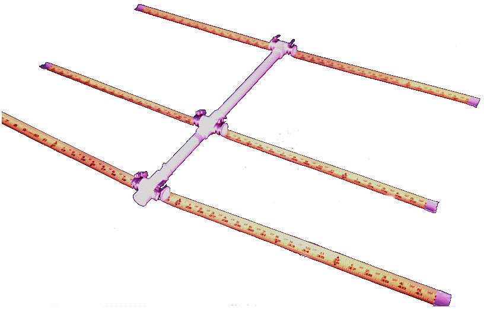
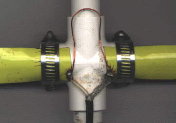
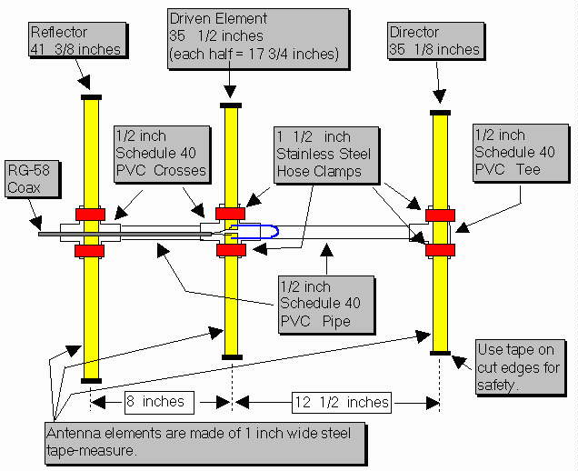
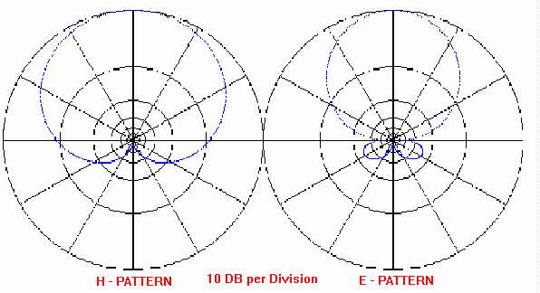
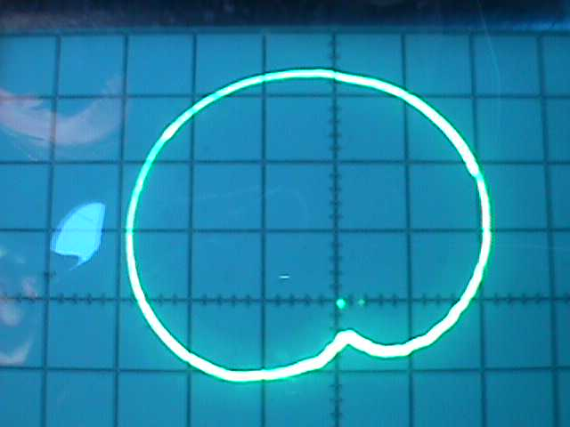

- originally http://pages.videotron.com/ve2jmk/tape_bm.htm
- recovered by
  https://web.archive.org/web/20121009234525/http://pages.videotron.com/ve2jmk/tape_bm.htm
- also seems to exist in https://xwarn.net/2022/01/04/joe-leggio-wb2hol-tape-measure-antenna/

_Joe Leggio WB2HOL_

### Description



This antenna evolved during my search for a beam with a really great
front-to-back ratio to use in hidden transmitter hunts. This design exhibits a
very clean pattern and is perfect for RDF use. It trades a bit of forward gain
in exchange for a very deep notch in the pattern toward the rear. (You could
optimize the design for more forward gain, but at the expense of a really good
notch in the pattern toward the rear.) It is a design that can be constructed
using only simple hand tools (no machine shop needed) and still perform well.
It has been duplicated several dozen times by other local hams and has been
successfully used as a club construction project.

When I designed this antenna I had one basic idea in mind. It had to be easy to
get in and out of the car when hunting for a hidden transmitter. This would be
accomplished by the use of steel "tape measure" elements. These elements could
fold easily when fitting the antenna into my car and yet still be self
supporting. I decided to use three elements to keep the boom from getting too
long.

Another of my design goals was to use materials that were easy to obtain. I
chose to use Schedule-40 PVC pipe and fittings available at my local hardware
store for the boom and element supports. These kept the cost for the antenna
very low. The element supports consist of PVC crosses and tees.

Since I had never seen any plans for an antenna using elements made from 1 inch
wide steel "tape measure," I had to do the design myself. To assist in the
design I used a shareware computer aided yagi design program written by Paul
McMahon VK3DIP. It allowed me to optimize the antenna for the cleanest pattern
combined with the best front-to-back ratio.

| **Performance Predicted by YAGI-CAD**  |

|--------------------:|------------------|
| GAIN                | 7.3 dBd          |
| Front-to-Back Ratio | > 50 db          |
| 3 db Beamwidth      | E = 67.5 degrees |
| 3 db Beamwidth      | H = 110 degrees  |


When I first built this beam I found it needed a matching network of some kind
to have a low SWR. My first attempt was a Gamma match. This was unwieldy. The
driven element could barely handle the weight and the Gamma match itself was
not very flexible. The best matching network turned out to be a "hairpin
match." This is simply a 5 inch length of wire that is connected across the
feed points of the driven element. The antenna has some capacitive reactance
without the matching network. The 5 inch length of wire has just enough
inductance to cancel the capacitive reactance. This resulted in a better match
than anything else I had tried.

The wire I used for the hairpin match was enamel insulated 18 gauge solid.
Other hams who have duplicated this beam have used just about anything they had
on hand. 14 gauge house wire works well, so does a length of 22 gauge hookup
wire. It does not seem to matter if it is stranded or solid, use whatever you
have available. This results in a very good match across the two meter band
once you have adjusted the distance between the halves of the driven element
for minimum SWR. (1 inch apart on my prototype).

I used a pair of shears to cut the tape measure elements to length. An old pair
of scissors will probably do as well. No matter how you cut the elements be
very careful. Those edges are very sharp and will inflict a nasty cut if you
are careless. Use some sandpaper to remove the really sharp edges and burrs
resulting from cutting the elements to size. I put some vinyl electrical tape
on the ends of the elements to protect myself from getting cut. I encourage you
to do the same. It will probably be best if you round the corners of the
elements once you cut them. Wear safety glasses while cutting the elements.
Those bits of tape measure can be hazardous.

The RG58 coax feedline is connected directly to the driven element. No matter
what method you use to attach the feedline, make sure you scrape or sand the
paint off the tape measure element where the feedline is attached. Most tape
measures have a very durable paint finish designed to stand up to heavy use.
You do not want the paint to insulate your feedline connection.

If you are careful, It is possible to solder the feedline to the element
halves. Care must be taken since the steel tape measure does not solder easily
and since the PVC supports are easily melted. You might want to tin the tape
measure elements before mounting them to the PVC cross.

If you decide not to solder to the tape measure elements, there are two other
methods that have been used to attach the feedline. One method employs ring
terminals on the end of the feedline. The ring terminals are then secured under
self tapping screws which hold the driven element halves. This method does not
allow you to tune the antenna by moving the halves of the driven element. 6-32
bolts and nuts could be used if holes are drilled in the elements near the
ends. If the bolt heads are placed nearest the PVC fitting, you could secure
ring-terminals with nuts and lock washers. Another possibility is to simply
slide the ends of the feedline under the driven element hose clamps and tighten
the clamps to hold the ends of the coax. I know this is low-tech, but it works
just fine.



Stainless steel hose clamps are used to attach the driven element halves to the
PVC cross which acts as its support. This has the added benefit of allowing you
to fine tune your antenna for lowest SWR simply by loosening the hose clamps
and sliding the halves of the driven element either closer or further apart. By
using the dimensions specified, I found that the SWR was 1:1 at 146.565 Mhz
(our Fox-Hunt frequency) when the two elements were spaced approximately 1 inch
apart. Figure 1 shows the method used to attach the driven element to the PVC
cross.

I used 1 1/2 inch hose clamps to attach all the elements on my prototype beam.
Others who have duplicated my design have used self tapping screws to attach
the elements to the PVC crosses and tees. Performance is the same using either
method. The screws are much less expensive but they do not hold the elements as
securely. If you do not use 1/2 inch PVC fittings but instead use 3/4 inch,
make sure the hose clamps you buy are large enough to fit.

If you wish a slightly neater looking beam, use the self tapping screws. If you
do not mind spending a few more dollars for the hose clamps, use them instead.
If I were to build another beam I would use screws for the director and
reflector, and hose clamps for the driven element. That would give me the best
of both methods.

Rubber faucet washers have been used by some builders between the tape measure
element and the PVC fittings on the director and reflector. These allow for the
tape to fit the contour of the PVC fitting and will make the antenna look
better. Now you know what to do with those washers left over from the
assortment you once purchased; You know the ones I mean, the washers that do
not fit the faucets you have in your house. If you are an apartment dweller,
ask around, these things are stashed in almost every homeowners basement or
garage.

### Construction



Cut a length of tape measure to 41 3/8 inches. It will be the Reflector
element. Cut two lengths of tape measure to 17 3/4 inches. These will be used
for the Driven element. Cut one length of tape measure to 35 1/8 inches. It
will be used for the Director. Once you have cut the tape measure to length,
put vinyl tape on the cut ends to protect yourself from the sharp edges. You
will want to scrape or sand off the paint from one end of each of the driven
element halves so you can make a good electrical connection to the feedline.

If you are planning to solder the feedline to the driven elements it is best to
tin the elements first before attaching them to the PVC cross. If you don’t,
the PVC will melt as you apply heat to the element. It would be a good idea to
also take the time to form the wire used for the hairpin match into a “U” shape
with the two legs of the “U” about 3/4 inch apart. Tin the ends of the hairpin
if you plan on soldering it to the driven element. If you tin 1/4 inch of each
end of the hairpin it will leave 4 1/2 inches to shape into the “U”.

You will need to cut two lengths of PVC pipe to use as the boom. One should be
cut to 11 1/2 inches. It is used to form the boom between the Director and the
driven element. The other piece of PVC should be cut to 7 inches. It will be
used between the Reflector and the Driven element. Just about any saw will cut
through the soft PVC pipe. I used a hacksaw. When we mass produced this antenna
as a club project, we marked the pipe and used a portable jig saw to cut the
lengths in assembly line fashion. It took longer to measure the pipe than to
actually make the cuts. Since the pipe is available in ten foot lengths, you
can make a few beams from a single 10 foot length. In any case, you might want
to cut a few extras lengths for your friends. They will want to duplicate this
once they see your completed antenna.

At this time you can pre-assemble the PVC boom, crosses and tee which will
support the tape measure elements. I did not use any cement or glue when I
assembled mine. The PVC pipe is secured in the fittings with a friction fit.

The hose clamps I used are stainless steel and have a worm-drive screw which is
used to tighten them. They are about 1/2 inch wide and are adjustable from
11/16 inch to 1 1/2 inch diameter. Attach the tape measure elements to the PVC
fittings as shown in the accompanying drawing. It is normal for the Reflector
and Director elements to buckle a bit as it is tightened to the PVC Tee and
Cross. You can eliminate this buckle if you use the washers and self tapping
screws to attach these elements instead of the hose clamps. I do not think the
beam will withstand as rough a treatment as when hose clamps are used.

### How does it perform?

Once you have completed your beam you probably will be interested to see if it
performs as well as the computer predicted. The SWR should be less than 2:1
across the entire two meter band. The front-to-back ratio is predicted to be
very good with the antenna exhibiting a very deep notch in its pattern towards
the rear. The **YagiCad 4.1**

> YagiCad 4.1 link on WebArchive:
> [https://web.archive.org/web/20121112163325/http://www.ipass.net/teara/kq3.html](https://web.archive.org/web/20121112163325/http://www.ipass.net/teara/kq3.html)

program produced these antenna pattern graphs showing the pattern you should
expect. If you would like to experiment a bit with this program, the yagi
specification file for this tape measure beam is available for download **here**.

> Here is a link to a `tape1.zip` file which has the following contents
> 
> ```
> VK3DIP YAGICAD FILE
> WB2HOL TAPE MEASURE FOX HUNT YAGI
> 06-19-1994
> WB2HOL
> Simple narrow band sniffer beam
>  7.333117 
>  50.74158 
>  17.50275 
> -52.88202 
>  3 
>  1.049         0             .0104 
>  .8991582      .2042156      .0104 
>  .8909919      .51797        .0104 
>  146.565 
> ```
>
> presumably this means something to
> [https://www.yagicad.com/yagicad/YagiCAD.htm](https://www.yagicad.com/yagicad/YagiCAD.htm)

Simply download the YAGI-CAD program and put the tape measure beam design file
in the same directory. You will then be able to experiment with the design.

Note: under Windows95, only the first .yag file will show in the OPEN-FILE
menu. You can either move all the other .yag files to a sub-directory or
re-start the computer in MS-DOS mode. It works fine there. (I really do not
know why this occurs but will blame Microsoft)



### How does the tape measure beam "measure up?"

WB4SUV and WA6EZV used a storage scope connected to a copy of this antenna
constructed by KC8FQY and provided the following picture of the actual antenna
pattern. I am very happy to see that the computer prediction of a clean pattern
with a really great front-to-back ratio was accurate. What do you think?



### Summary

This beam has been used on Fox-Hunts, on mountain tops, at local public service
events, outdoors, indoors in attics, just about everywhere. The SWR is
typically very close to 1:1 once adjusted. Front to back performance is exactly
as predicted. The null in the rear of the pattern is perfect for transmitter
hunts. When tested using a sensitive field strength meter and a low powered fox
transmitter, full scale readings were seen from a distance of ten feet. With
the same field strength meter I was able to point the antenna away from the
transmitter and move the reflector element to within a few inches of the
transmitter antenna and still not see a reading. I don’t have the facilities to
verify a 50 db notch as predicted by the Yagi-Cad software but It sure seems
close. The flexible elements have taken a lot of abuse. My antenna has seen a
lot of use and has held up quite well. Best of all, when on a fox-hunt, this
beam is a breeze to get in or out of the car.

**Back to RDF Projects page**

link takes you back to some interesting old articles

- **Antennas**
    - Tape Measure 3 Element Yagi - RDF Optimized Beam - Updated 05/17/98 with
      actual plot of antenna pattern.
    - RDF2 - 2 Element Sniffer Beam with Tape Measure Elements - Added 12/12/97
- **Attenuators**
    - Passive Attenuator - easy for beginners - Updated 12/19/97.
    - Active Attenuator - Slightly more complex than the passive attenuator.
      Updated 04/18/98.
- **Time-Difference-Of-Arrival RDF UNITS**
    - 555 Time-Difference-Of-Arrival RDF UNIT - Minimum T.D.O.A. Circuit. NEW
      05/01/98
    - SIMPLE Time-Difference-Of-Arrival RDF UNIT - A center scale meter shows
      which way to transmitter.
- **Fox Timers and Controllers**
    - The FOX TIMER - travel alarm used to control 250 milliwatt transmitter.
    - FOXBOX Transmitter Controller
- **Fox Transmitters**
    - THE FOX - two transistor 40 milliwatt fox transmitter NEW 04/22/98
    - THE FOX-750 - three transistor 750 milliwatt fox transmitter NEW 04/25/98
- **Other RDF Projects**
    - Amplified Field Strength Meter (construction details in TRANSMITTER
      HUNTING book)
    - A Compass Rose suitable for the base of your antenna mount. Download it
      and then reduce scale as needed before printing. (it is big!)
    - Homebrew air-core resolver for electronic compass.

