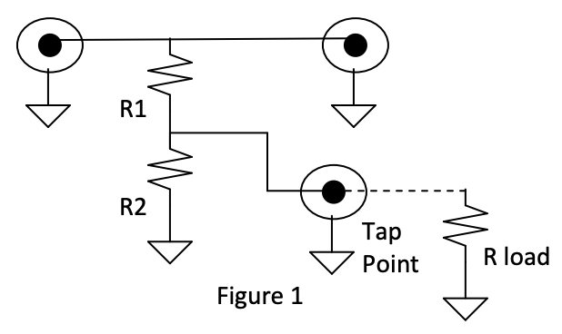
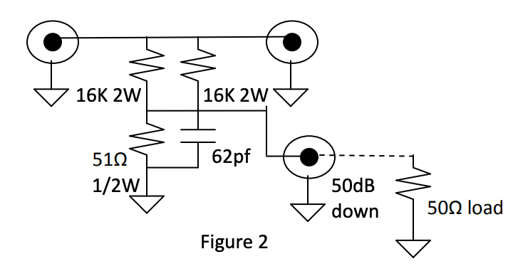
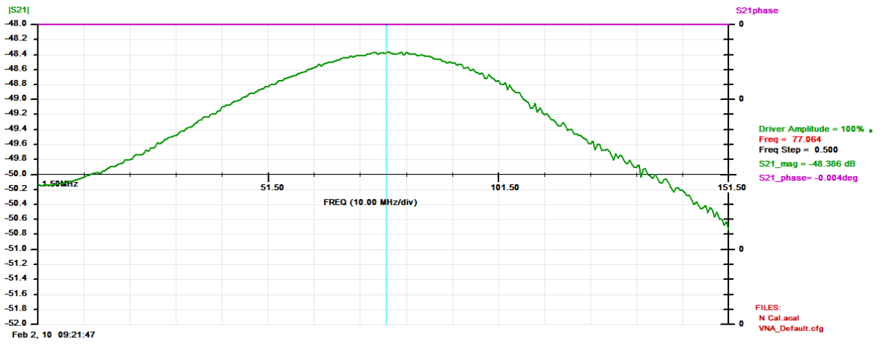
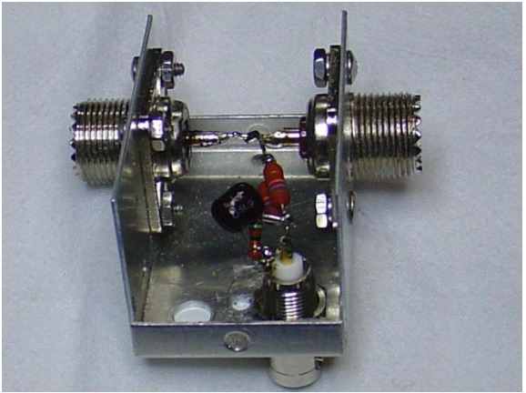
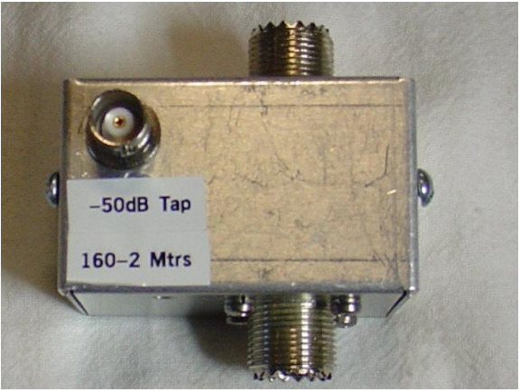

- originally http://www.ad5x.com/images/Articles/Tap50dbRevA.pdf
- recovered by
  https://web.archive.org/web/20170124004030/http://www.ad5x.com/images/Articles/Tap50dbRevA.pdf

_Phil Salas – AD5X_

I have a HAMMEG spectrum analyzer that I like to use for measuring harmonic
content and distortion of

my transmitters and amplifiers. The maximum input level into this spectrum
analyzer is +20dBm (100 milliwatts). As I have a 600 watt amplifier (Ameritron
ALS-600), I decided that a 50dB tap would give me a comfortable level for
monitoring my maximum signal without overloading the spectrum analyzer. 50dB
down from 600 watts is 6-milliwatts or about +8dBm.

Referring to Figure 1 below, you can determine the tap coupling level using the
normal voltage divider equation:

```
Vout = Vin x R2 ÷ (R1 + R2)
```
, where Rload is a high impedance load such as an oscilloscope probe.

For a 50 ohm load, like you may have with a power meter of spectrum analyzer, a
finite R load must be considered in the voltage divider equation, as R load is
in parallel with R2:

```
Vout = Vin x R2//R load ÷ (R1 + R2//R load)
```

To determine the level in dB: Tap (db) = 20 log10 (Vout)



For my 50dB tap, I wanted to use commonly available resistors. It turns out
that 8K ohms and 25 ohms will give you the desired 50dB tap point:

```
50 dB = 20 log (8000/25)
```

I realized the circuit using two 16K 2-watt resistors in parallel, and a 51 ohm
½-watt resistor as shown in Figure 2 below. I needed the 2-watt resistors due
to the power that is dissipated in these resistors at 600 watts. Assuming your
through line is terminated by a 50 ohm dummy load, the voltage across the
voltage divider can be easily determined:

```
RF Pwr = V^2/R, so
V^2 = PwrxR = 600x50 = 30,000
```

So power dissipated in the resistors (neglecting the 51 ohm resistor as this is
negligible)

```
Pres = V^2/R = 30,000/8000 = 3.75 watts, hence the two 2-watt resistors.
```



You’ll also note the 62pf capacitor. I found that the 51 ohm resistor is
slightly more inductive than the two parallel 16K resistors, resulting in
peaking of the detected power as the frequency was increased. The 62pf
capacitor helps compensate this at the higher frequencies.

Figure 3 below shows the swept coupling response of the 50dB tap point. You can
see that the coupling starts to reduce due to the 51 ohm resistor inductance,
but then decreases as the 62pf capacitor begins to compensate for this
inductance. The tap point is very close to 50dB at HF and 2-meters, and about
49 dB on 6-meters.



_Figure 3 – Swept coupling response from 1.5-150 MHz)

Remember, if you use a high impedance measuring device such as an oscilloscope,
the coupling will be 6dB less (approximately 44 dB) unless you also terminate
the tap output port in 50 ohms.

Photo 1 shows the internal wiring, and Photo 2 shows the external view of the
finished product.



_Photo 1: Internal view of the 50dB tap_



_Photo 2: The final product_

All necessary parts are listed in the Part List of Table 1. All components were
obtained from Mouser Electronics (www.mouser.com).

_Table 1 – 50dB Tap Bill of Materials_


QTY | Description           | Mouser PN       | Price ea.
----|-----------------------|-----------------|----------
  2 | UHF connectors        | 601-25-7350     |  $1.33
  1 | BNC connector         | 530-CP-1094-AST |  $2.67
  2 | 16K 2W resistors      | 262-16K-RC      |  $0.19
  1 | 51Ω ½-watt resistor   | 293-51-RC       |  $0.05
  1 | 2.25x1.5x1.38” AL box | 537-M00-P       |  $4.37

